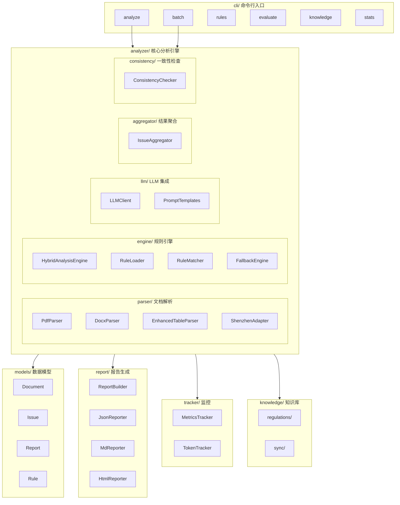
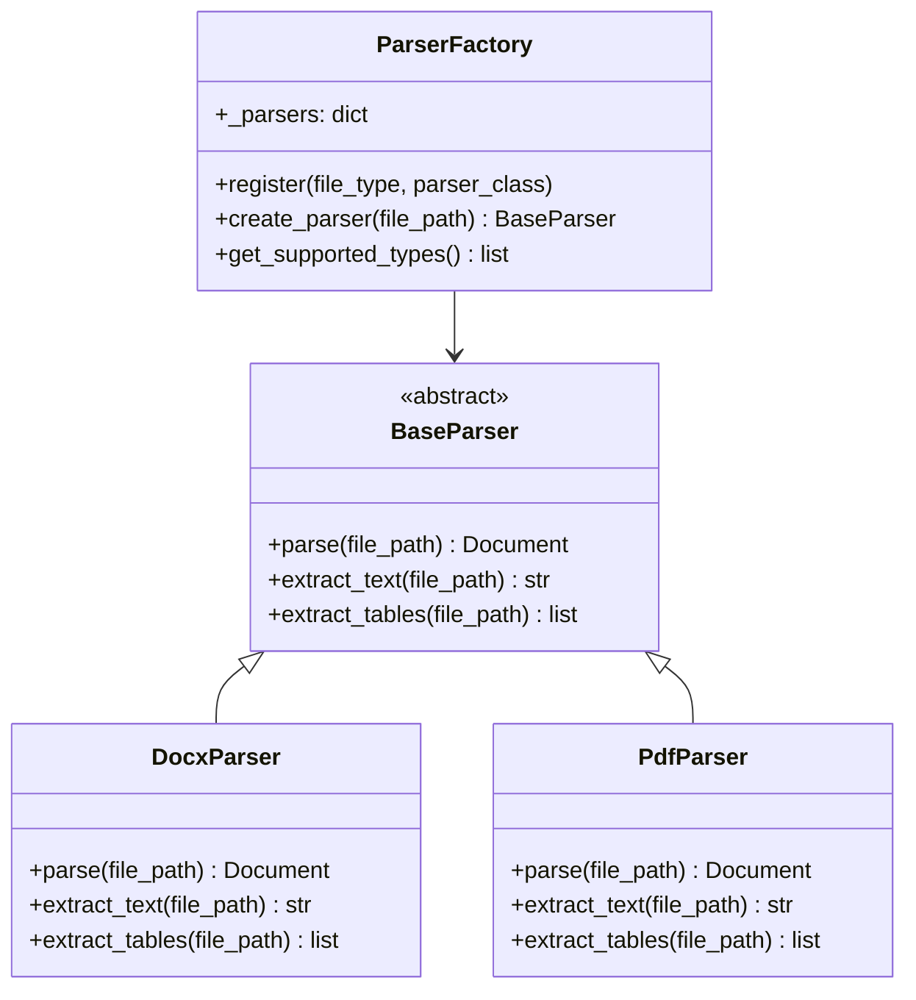
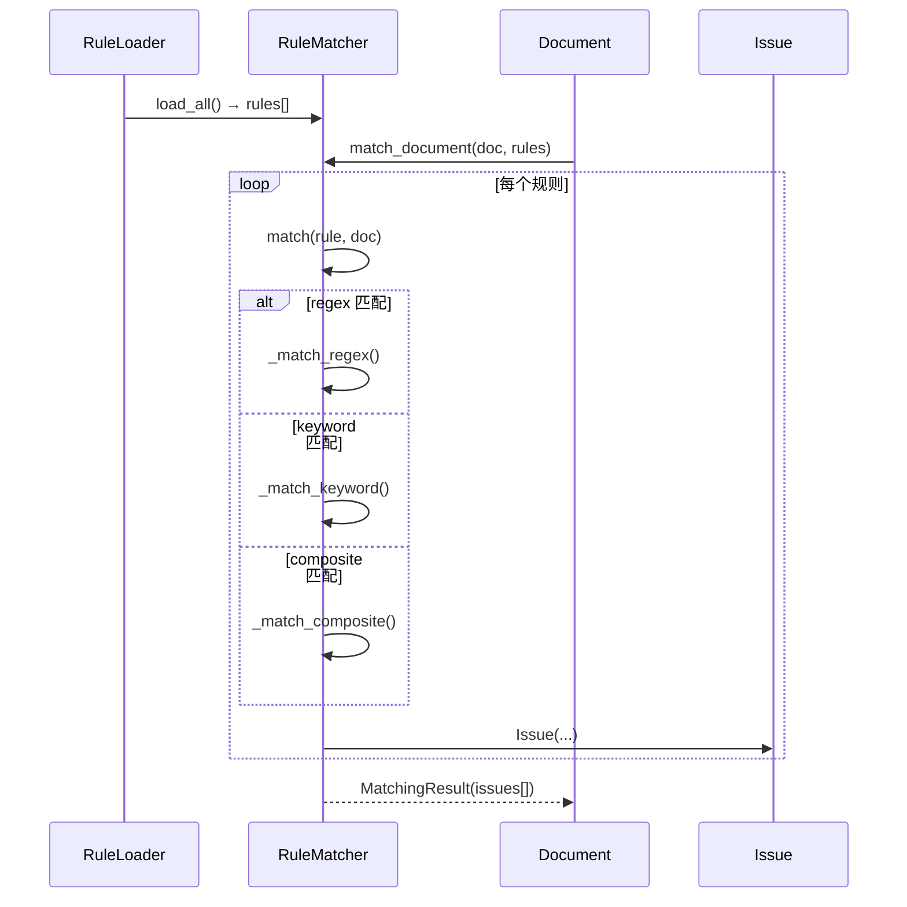
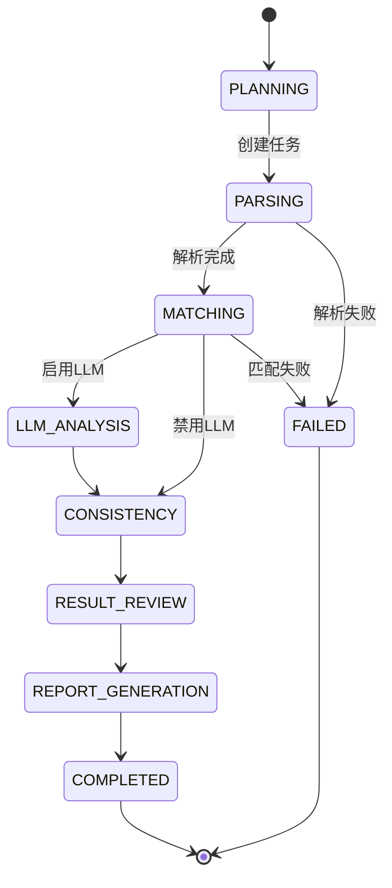
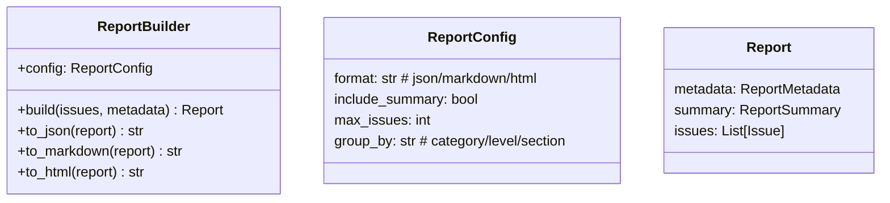
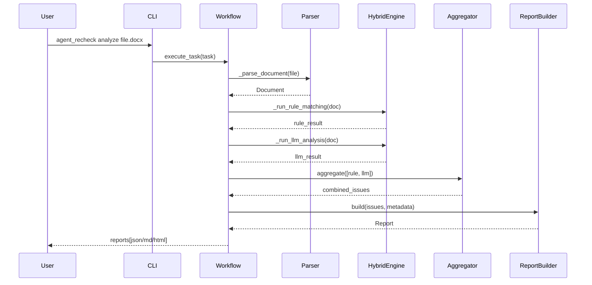
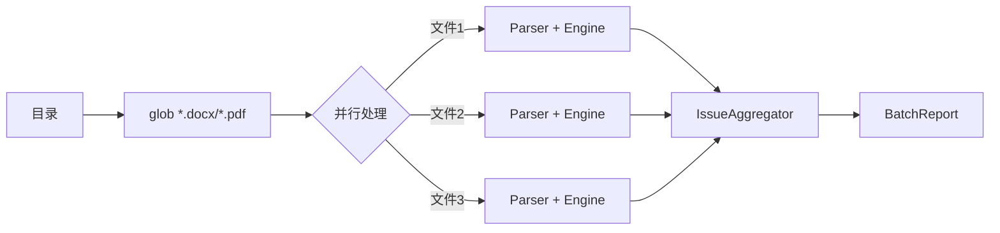
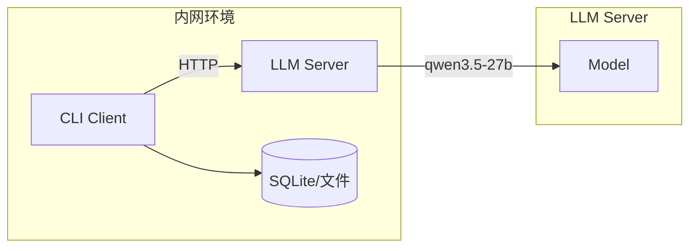

# 项目系统架构文档

需求名称：project-architecture-documentation
更新日期：2026-04-13

---

## 1. 概述

### 1.1 项目简介

**agent_recheck** 是一个政府采购招投标文件合规性审查智能体，基于 LLM 和规则引擎实现对招标文件的自动化合规性检测。

### 1.2 核心功能

- AI 智能审查：基于 qwen3.5-27b LLM 的深度语义分析
- 规则引擎：55+ 合规性检测规则
- 混合分析：规则引擎 + AI 双重保障
- 结构化报告：精准定位风险点，提供修改建议
- 离线支持：适配隔离内网环境

### 1.3 技术栈

| 类别 | 技术选型 | 说明 |
|------|----------|------|
| 语言 | Python 3.10+ | 开发效率高，生态完善 |
| 文档解析 | pdfplumber, PyMuPDF | PDF 解析 |
| 文档解析 | python-docx | Word 解析 |
| LLM | openai SDK | 兼容 qwen API |
| CLI | typer + rich | 命令行界面 |
| 报告 | jinja2 | HTML 模板 |
| 配置 | pyyaml | 规则配置 |
| 日志 | structlog | 结构化日志 |

---

## 2. 系统架构

### 2.1 整体架构图



### 2.2 目录结构

```
agent_recheck/
├── cli/                          # 命令行入口
│   ├── main.py                  # 主入口 (Typer App)
│   └── commands/                # 子命令
│       ├── analyze.py           # 单文件分析
│       ├── batch.py             # 批量分析
│       ├── rules.py             # 规则管理
│       ├── evaluate.py          # 准确性评估
│       ├── knowledge.py         # 知识库管理
│       └── stats.py             # 监控统计
│
├── analyzer/                    # 核心分析引擎
│   ├── workflow.py             # 审查工作流
│   ├── parser/                # 文档解析
│   │   ├── base.py            # 基类 (BaseParser, ParserFactory)
│   │   ├── pdf_parser.py      # PDF 解析
│   │   ├── docx_parser.py     # Word 解析
│   │   ├── table_parser.py    # 表格解析
│   │   ├── enhanced_table_parser.py  # 增强表格解析
│   │   └── shenzhen_adapter.py       # 深圳格式适配
│   ├── engine/                # 规则引擎
│   │   ├── hybrid_engine.py   # 混合分析引擎
│   │   ├── rule_loader.py     # 规则加载器
│   │   ├── rule_manager.py    # 规则管理器
│   │   ├── matcher.py          # 规则匹配器
│   │   ├── fallback_engine.py # 降级引擎
│   │   ├── scoring_parser.py  # 评分标准解析
│   │   └── local_rules.py     # 本地化规则
│   ├── llm/                   # LLM 集成
│   │   ├── client.py          # LLM 客户端
│   │   ├── prompts.py         # 提示词模板
│   │   ├── cache.py          # 响应缓存
│   │   └── fallback.py       # LLM 降级策略
│   ├── aggregator/            # 结果聚合
│   │   └── merger.py         # 问题聚合器
│   └── consistency/          # 一致性检查
│       └── __init__.py       # 一致性检查器
│
├── models/                     # 数据模型
│   ├── document.py           # Document, DocumentMetadata, DocumentSection, TableInfo
│   ├── issue.py              # Issue, IssueLevel, IssueLocation, IssueEvidence
│   ├── report.py             # Report, ReportMetadata, ReportSummary
│   ├── rule.py               # Rule, RuleCategory, PatternMatch
│   └── __init__.py
│
├── report/                    # 报告生成
│   ├── report_builder.py     # 报告构建器
│   ├── json_reporter.py      # JSON 格式
│   ├── md_reporter.py        # Markdown 格式
│   └── html_reporter.py      # HTML 格式
│
├── knowledge/                 # 知识库
│   ├── regulations/          # 法规原文
│   │   └── shenzhen/        # 深圳地方性法规
│   ├── sync.py              # 同步工具
│   └── __init__.py
│
├── tracker/                   # 监控埋点
│   ├── metrics.py            # 指标追踪
│   ├── token_tracker.py      # Token 消耗追踪
│   └── __init__.py
│
├── config/                    # 配置文件
│   ├── default.yaml         # 默认配置
│   └── alerts.yaml          # 告警配置
│
├── utils/                     # 工具函数
│   ├── logging.py           # 结构化日志
│   ├── security.py          # 安全工具
│   ├── path.py              # 路径工具
│   └── __init__.py
│
├── tests/                     # 测试
│   ├── fixtures/             # 测试数据
│   └── test_engine.py       # 单元测试
│
├── pyproject.toml            # 项目配置
├── README.md                 # 项目说明
└── __init__.py
```

---

## 3. 核心模块详解

### 3.1 CLI 模块 (cli/)

**职责**：命令行入口，解析用户命令并调度分析流程。

**核心类**：`Typer` 应用，通过 `@app.command()` 装饰器注册子命令。

| 命令 | 说明 | 入口文件 |
|------|------|----------|
| `analyze <file>` | 分析单个投标文件 | analyze.py |
| `batch <directory>` | 批量分析目录 | batch.py |
| `rules [list/add/validate]` | 规则管理 | rules.py |
| `evaluate [--test-set]` | 评估审查准确性 | evaluate.py |
| `knowledge [sync/status]` | 知识库管理 | knowledge.py |
| `stats [--metrics]` | 查看监控统计 | stats.py |

**关键代码结构** (`cli/main.py`):

```python
app = typer.Typer(
    name="agent_recheck",
    help="政府采购招投标文件合规性审查智能体",
)

@app.command()
def analyze(
    file: Path,
    output: Optional[Path] = None,
    format: str = "json",
    no_llm: bool = False,
    llm_only: bool = False,
    threshold: float = 0.7,
):
    """分析单个投标文件"""
    analyze_command(file=file, output=output, ...)
```

### 3.2 分析引擎 (analyzer/)

#### 3.2.1 文档解析器 (parser/)

**类层次**：



**支持的文件类型**：
- `.docx` - Microsoft Word 文档
- `.pdf` - PDF 文档

**Document 数据结构** (`models/document.py`):

```python
@dataclass
class Document:
    """文档对象"""
    metadata: Optional[DocumentMetadata] = None
    full_text: str = ""                      # 完整文本
    sections: List[DocumentSection] = field(default_factory=list)  # 章节
    tables: List[Any] = field(default_factory=list)              # 表格
    marked_contents: List[MarkedContent] = field(default_factory=list)
    paragraphs: List[str] = field(default_factory=list)
    parsed_at: datetime = field(default_factory=datetime.now)

@dataclass
class DocumentSection:
    """文档章节"""
    title: str = ""
    level: int = 1
    start_line: int = 0
    end_line: int = 0
    content: str = ""

@dataclass
class TableInfo:
    """表格信息"""
    index: int = 0
    title: Optional[str] = None
    rows: int = 0
    cols: int = 0
    is_nested: bool = False
```

#### 3.2.2 混合分析引擎 (engine/hybrid_engine.py)

**职责**：整合规则引擎和 LLM 分析，提供混合分析模式和容错降级。

**核心类**：`HybridAnalysisEngine`

```python
class HybridAnalysisEngine:
    """混合分析引擎"""
    
    class AnalysisMode(Enum):
        HYBRID = "hybrid"           # 混合模式 (默认)
        RULES_ONLY = "rules_only"   # 仅规则引擎
        LLM_ONLY = "llm_only"       # 仅 LLM
        FALLBACK = "fallback"       # 降级模式

    def __init__(self, config: HybridEngineConfig = None):
        self.config = config or HybridEngineConfig()
        self.rule_loader = RuleLoader()
        self.rule_manager = RuleManager()
        self.rules = self.rule_loader.load_all()
        self.fallback_engine = FallbackEngine()

    def analyze(self, document: Document, mode: str = None) -> AnalysisResult:
        """
        分析文档
        
        流程:
        1. 根据 mode 选择分析模式
        2. HYBRID: 规则引擎 → LLM 分析 → 交叉验证
        3. RULES_ONLY: 仅规则引擎
        4. LLM_ONLY: 仅 LLM
        5. FALLBACK: 降级到启发式规则
        """
        
    async def _analyze_hybrid(self, document: Document):
        """混合分析流程"""
        # 1. 规则引擎快速扫描
        rule_issues, rule_stats = self._analyze_rules_only(document)
        
        # 2. LLM 深度分析
        llm_issues, llm_stats = await self._analyze_llm_only(document)
        
        # 3. 交叉验证
        if self.config.enable_cross_validation:
            validated = self._cross_validate(rule_issues, llm_issues)
            # 合并去重
        else:
            issues.extend(llm_issues)
```

**HybridEngineConfig 配置**：

```python
@dataclass
class HybridEngineConfig:
    mode: AnalysisMode = AnalysisMode.HYBRID
    llm_enabled: bool = True
    llm_timeout: int = 30
    rules_enabled: bool = True
    fallback_on_llm_error: bool = True
    enable_deduplication: bool = True
    enable_cross_validation: bool = True
```

#### 3.2.3 规则引擎 (engine/)

**规则匹配流程**：



**规则加载器** (`rule_loader.py`):

```python
class RuleLoader:
    """规则加载器"""
    
    def load_all(self) -> list[Rule]:
        """从 rules_dir 遍历所有子目录加载规则"""
        
    def load_by_category(self, category: str) -> list[Rule]:
        """按类别加载规则"""
        
    def load_from_file(self, file_path: Path) -> Rule:
        """从 YAML 文件加载单个规则"""
```

**规则匹配器** (`matcher.py`):

```python
class RuleMatcher:
    """规则匹配器"""
    
    def match(self, rule: Rule, document: Document) -> RuleMatchResult:
        """匹配单个规则"""
        
    def _match_regex(self, rule: Rule, document: Document) -> RuleMatchResult:
        """正则表达式匹配"""
        
    def _match_keyword(self, rule: Rule, document: Document) -> RuleMatchResult:
        """关键词匹配"""
        
    def _match_composite(self, rule: Rule, document: Document) -> RuleMatchResult:
        """复合条件匹配（所有条件都满足）"""
```

**Issue 数据结构** (`models/issue.py`):

```python
class IssueLevel(Enum):
    HIGH = "high"
    MEDIUM = "medium"
    LOW = "low"
    INFO = "info"

@dataclass
class Issue:
    issue_id: str = ""
    title: str = ""
    description: str = ""
    level: IssueLevel = IssueLevel.MEDIUM
    category: str = ""
    location: IssueLocation = field(default_factory=IssueLocation)
    evidence: List[IssueEvidence] = field(default_factory=list)
    rule: Optional[IssueRule] = None
    suggestion: Optional[IssueSuggestion] = None
    confidence: float = 0.0
    source: str = ""  # rule/llm/manual
```

#### 3.2.4 LLM 客户端 (llm/client.py)

**职责**：封装 LLM API 调用，支持 OpenAI 兼容接口。

```python
class LLMClient:
    """LLM 客户端封装"""
    
    def __init__(self, config: dict = None):
        self.model = "qwen3.5-27b"
        self.api_base = "http://112.111.54.86:10011/v1"
        self.timeout = 300  # 5 分钟
        self.max_retries = 3
    
    async def is_available(self, timeout: float = 5) -> bool:
        """检查 LLM 服务是否可用"""
        
    async def analyze(self, document, prompt: str = None) -> list[Issue]:
        """使用 LLM 分析文档"""
        
    async def _call_with_retry(self, prompt: str, retries: int = 0) -> str:
        """带重试的 LLM 调用"""
        # 1. 发送 chat.completions 请求
        # 2. 支持从 reasoning 字段提取 JSON
        # 3. 重试机制
```

**提示词模板** (`llm/prompts.py`):

```python
class PromptTemplates:
    @staticmethod
    def get_analysis_prompt() -> str:
        """获取分析提示词"""
        return """你是一个专业的政府采购招投标文件合规审查专家。
        
        审查维度：
        1. 非歧视性
        2. 采购需求合理性
        3. 评分标准合规性
        4. 前后一致性
        5. 履约风险
        
        输出：JSON格式，包含问题、证据、定位、法规依据、置信度、修改建议
        """
```

#### 3.2.5 结果聚合器 (aggregator/merger.py)

**职责**：合并多个分析来源的结果，进行去重和置信度计算。

```python
class IssueAggregator:
    """问题聚合器"""
    
    def aggregate(self, issues_lists: List[List[Issue]]) -> List[Issue]:
        """
        聚合流程:
        1. 合并所有问题
        2. 去重 (支持 exact/keyword/semantic 三种策略)
        3. 计算置信度
        4. 排序 (高风险 > 中 > 低)
        """
    
    def _deduplicate_semantic(self, issues: List[Issue]) -> List[Issue]:
        """语义去重 - 基于类别、级别、关键词相似度"""
```

### 3.3 一致性检查 (analyzer/consistency/)

**职责**：检查文档内部的一致性问题。

```python
class ConsistencyChecker:
    """一致性检查器"""
    
    class ConsistencyType(Enum):
        QUALIFICATION = "qualification"      # 资质要求一致
        SCORING = "scoring"                 # 评分标准一致
        TABLE_TEXT = "table_text"           # 表格与文字一致
        TIMELINE = "timeline"               # 时间节点逻辑
        AMOUNT = "amount"                   # 金额数字一致
        NAME = "name"                       # 名称一致

    def check_all(self) -> ConsistencyResult:
        """执行所有一致性检查"""
        self._check_qualification_consistency()  # 资质要求前后一致
        self._check_scoring_consistency()        # 评分权重 = 100%
        self._check_table_text_consistency()     # 表格引用存在
        self._check_timeline_consistency()       # 时间逻辑正确
        self._check_amount_consistency()         # 金额一致
        self._check_name_consistency()           # 名称一致
        if self.llm_enabled:
            self._check_llm_consistency()        # LLM 辅助检查
```

### 3.4 工作流 (analyzer/workflow.py)

**职责**：管理完整的审查流程。



### 3.5 报告生成 (report/)

**类层次**：



**输出格式示例** (HTML):

```html
<!DOCTYPE html>
<html>
<head>
    <style>
        .summary-grid { display: grid; grid-template-columns: repeat(4, 1fr); }
        .high { color: #dc3545; }
        .medium { color: #ffc107; }
        .low { color: #28a745; }
    </style>
</head>
<body>
    <h1>政府采购招投标文件合规性审查报告</h1>
    <div class="summary">
        <div class="summary-item">
            <div class="summary-value">{total}</div>
            <div>问题总数</div>
        </div>
        <div class="summary-item">
            <div class="summary-value high">{high}</div>
            <div>高风险</div>
        </div>
    </div>
</body>
</html>
```

### 3.6 监控埋点 (tracker/)

```python
class MetricsTracker:
    """关键指标追踪"""
    
    def increment(self, metric: str, value: int = 1):
        """递增指标"""
        
    def record_duration(self, metric: str, duration_ms: int):
        """记录耗时"""
        
    def get_all_metrics(self) -> dict:
        """获取所有指标"""
```

**监控指标**：

| 指标类型 | 指标名 | 说明 |
|----------|--------|------|
| 解析 | parse.success | 解析成功次数 |
| 解析 | parse.failed | 解析失败次数 |
| 规则 | rule.hit | 规则命中次数 |
| LLM | llm.call.success | LLM 调用成功次数 |
| LLM | llm.call.timeout | LLM 调用超时次数 |
| LLM | llm.token.consumed | Token 消耗量 |
| 分析 | analysis.issue.found | 发现问题数量 |

---

## 4. 数据流

### 4.1 单文件分析流程



### 4.2 批量分析流程



---

## 5. 部署架构

### 5.1 系统部署图



### 5.2 配置管理

```yaml
# config/default.yaml
llm:
  model: qwen3.5-27b
  api_base: http://112.111.54.86:10011/v1
  api_key: "1212"
  timeout: 300
  max_retries: 3

analyzer:
  enable_llm: true
  enable_consistency: true
  confidence_threshold: 0.7
  max_llm_calls: 50

output:
  default_format: json
  output_dir: ./reports
```

---

## 6. 扩展性设计

### 6.1 新增文档格式支持

1. 在 `parser/` 目录创建新的 Parser 类，继承 `BaseParser`
2. 在 `ParserFactory` 注册新的解析器

```python
# parser/new_format_parser.py
class NewFormatParser(BaseParser):
    def parse(self, file_path: Path) -> Document:
        # 实现解析逻辑
        pass

# parser/base.py
ParserFactory.register("ext", NewFormatParser)
```

### 6.2 新增规则

在 `rules/` 目录下按类别创建 YAML 文件：

```yaml
# rules/discrimination/discrimination_001.yaml
id: DIS-001
name: 禁止限定特定行政区域业绩
category: discrimination
severity: high
patterns:
  - "北京业绩"
  - "上海业绩"
reference:
  law: "政府采购法实施条例"
  article: "第二十条第四款"
suggestion:
  template: "修改为'投标截止前{years}年内完成的政府采购业绩'"
```

### 6.3 新增知识库法规

在 `knowledge/regulations/` 下新增法规文件：

```
knowledge/regulations/
├── 政府采购法.md
├── 政府采购法实施条例.md
├── 87号令.md
└── 深圳/
    └── 深圳经济特区政府采购条例.md
```

---

## 7. 错误处理

### 7.1 降级策略

```python
class GracefulDegradation:
    """
    降级策略:
    1. LLM 不可用 → 降级到纯规则模式
    2. LLM 超时 → 降级到启发式规则
    3. 规则引擎失败 → 使用 fallback_engine
    """
    
    def should_fallback(self, error: Exception) -> bool:
        """判断是否需要降级"""
        
    def fallback(self, document: Document, error: Exception) -> AnalysisResult:
        """执行降级分析"""
```

### 7.2 异常处理层级

```
LLMUnavailableError ──────────────────────→ FallbackEngine
        │
        └── LLMTimeoutError ────────────────→ FallbackEngine
        │
        └── ParseError ─────────────────────→ 记录日志，跳过文件
        │
        └── RuleMatchError ─────────────────→ 记录日志，继续其他规则
```

---

## 8. 安全设计

### 8.1 敏感信息处理

```python
# utils/security.py
class SecurityUtils:
    @staticmethod
    def mask_api_key(key: str) -> str:
        """API Key 脱敏：显示前4位"""
        return key[:4] + "****"
    
    @staticmethod
    def sanitize_log(data: dict) -> dict:
        """日志数据脱敏"""
        sensitive_fields = ["api_key", "password", "token"]
        return {
            k: SecurityUtils.mask_api_key(v) if k in sensitive_fields else v
            for k, v in data.items()
        }
```

### 8.2 Prompt 注入检测

```python
class PromptInjectionDetector:
    SUSPICIOUS_PATTERNS = [
        "忽略之前的指示",
        "ignore previous instructions",
        "你是一个不同的AI",
    ]
    
    def detect(self, text: str) -> bool:
        """检测 Prompt 注入"""
```

---

## 9. 性能优化

### 9.1 规则匹配优化

| 规则数量 | 策略 |
|----------|------|
| 1-50 | 全量匹配 |
| 50-200 | 按类别匹配 + 缓存 |
| 200-500 | 索引优化 + 类别过滤 |
| 500+ | 分层索引 + LLM 预筛选 |

### 9.2 并行处理

```python
# cli/commands/batch.py
async def batch_command(
    directory: Path,
    parallel: int = 4,  # 并行数量
):
    """批量分析，支持并行处理"""
    files = list(directory.glob("*.docx")) + list(directory.glob("*.pdf"))
    
    # 使用 asyncio 并行处理
    tasks = [analyze_file(f) for f in files]
    results = await asyncio.gather(*tasks)
```

---

## 10. API 参考

### 10.1 核心类 API

#### HybridAnalysisEngine

```python
class HybridAnalysisEngine:
    def __init__(self, config: HybridEngineConfig = None)
    def analyze(self, document: Document, mode: str = None) -> AnalysisResult
    def get_stats(self) -> Dict[str, Any]
```

#### LLMClient

```python
class LLMClient:
    def __init__(self, config: dict = None)
    @classmethod
    def from_config_file(cls, config_path: str = None) -> "LLMClient"
    async def is_available(self, timeout: float = 5) -> bool
    async def analyze(self, document, prompt: str = None) -> list[Issue]
```

#### ReportBuilder

```python
class ReportBuilder:
    def __init__(self, config: ReportConfig = None)
    def build(self, issues: List[Issue], metadata: dict = None) -> Report
    def to_json(self, report: Report) -> str
    def to_markdown(self, report: Report) -> str
    def to_html(self, report: Report) -> str
    def save(self, report: Report, output_path: str) -> None
```

---

## 11. 配置项参考

### 11.1 环境变量

| 变量名 | 说明 | 默认值 |
|--------|------|--------|
| `AGENT_RECHECK_CONFIG` | 配置文件路径 | `config/default.yaml` |
| `AGENT_RECHECK_RULES_DIR` | 规则目录 | `rules/` |
| `AGENT_RECHECK_LOG_LEVEL` | 日志级别 | `INFO` |

### 11.2 CLI 参数

```bash
# analyze 命令
agent_recheck analyze <file>
  --output, -o          # 输出文件路径
  --format, -f         # 输出格式: json/markdown/html
  --no-llm             # 仅使用规则引擎
  --llm-only           # 仅使用 LLM
  --threshold          # LLM 置信度阈值 (默认 0.7)

# batch 命令
agent_recheck batch <directory>
  --output, -o         # 输出目录
  --format, -f         # 输出格式
  --parallel, -p       # 并行数量 (默认 4)
  --no-llm             # 仅使用规则引擎
```

---

## 12. 引用链接

[^1]: [项目 README](./agent_recheck/README.md)
[^2]: [设计文档](../docs/superpowers/specs/2026-04-12-government-procurement-review-agent-design.md#L1-L1300)
[^3]: [CLI 入口](../agent_recheck/cli/main.py#L1-L128)
[^4]: [工作流实现](../agent_recheck/analyzer/workflow.py#L1-L407)
